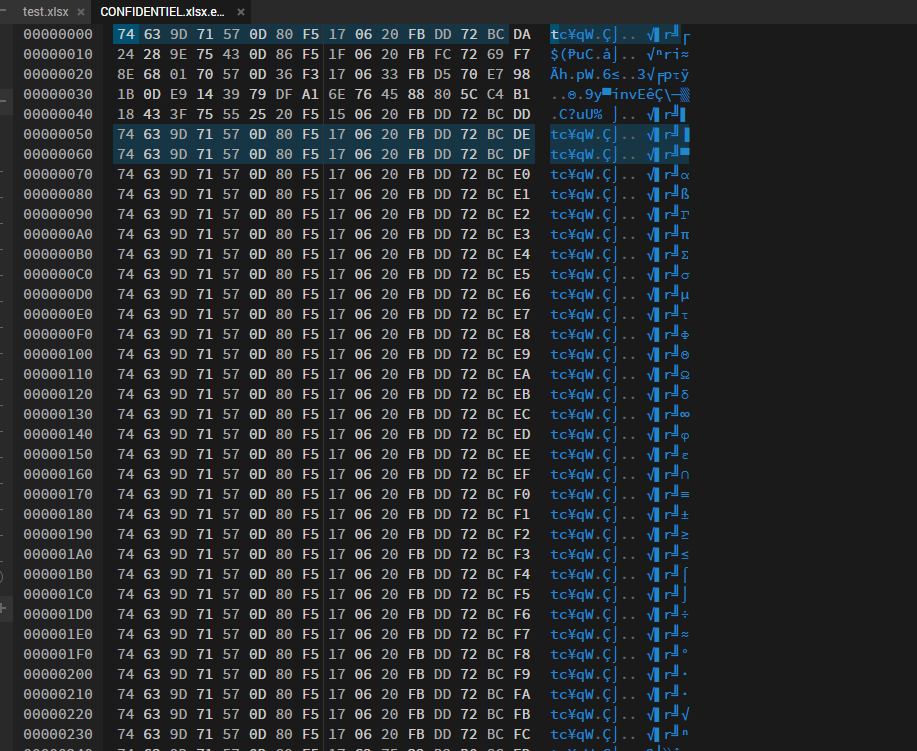
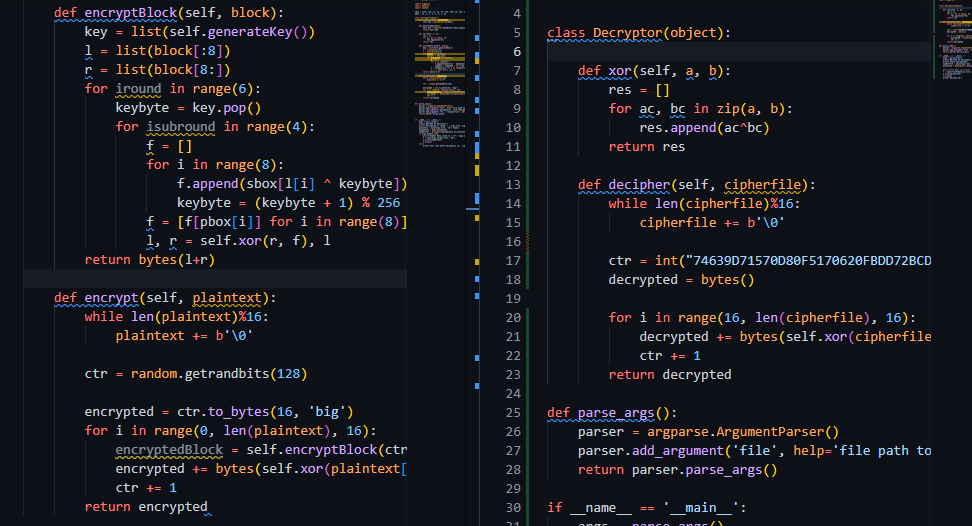

# Crypto
## Description :
Vous avez réussi à obtenir l'accès au dossier où se situent les fichiers uploadés. Cependant, tous les fichiers sont chiffrés.
Fort heureusement, l'algorithme de chiffrement est présent dans le dossier, trouver un moyen de le déchiffrer.

## Information complémentaire : 
Essayez de vous attaquer à une partie de l'algorithme pour réduire le temps de calcul.

## Source :
encrypt.py et CONFIDENTIEL.xlsx.enc

---

## Resolution : 

Je tiens à remercier N00tice, pour ses explications qui m'ont permis de résoudre le challenge.

Dans un premier temps, j'ai analysé le script afin de comprendre son fonctionnement.

En analysant, je remarque que la passphrase est utilisé dans la fonction   `__init__` pour l'encoder dans le **self.key**, le self.key est appelé dans la fonction **"generateKey"**  et celle-ci est seulement utilisé dans **"encryptBlock"**.

Je m'intéresse à la partie **"encrypt(plaintext)"** et je remarque que dans la fonction "Encrypt" que l'encryptedBlock n'est pas utilisé. Seulement la fonctionn "Xor" est appelée.

Par la suite, j'ai exécuté le script encrypt.py en mode debug pour comprendre son fonctionnement avec un fichier factice. 

Je remarque qu'il créait des blocs de 16 octets à chaque fois et que le CTR corresponds à notre "clé" pour déchiffrer le fichier.

Je vois qu'il y'a une variable "encrypted" contient le CTR qui le met en 16 octets en big. Donc on sait que ce block d'octet sera mis en premier.

En ouvrant le fichier CONFIDENTIEL.xlsx.enc avec (Hexed)[https://hexed.it/] 

On peut remarquer que la première ligne correspond à notre CTR en Hexadecimal, ce qui va nous permettre de déchiffrer notre fichier par la suite.

Afin de déchiffrer le fichier, j'ai créé un decrypt.py en reprenant le code de encrypt.py et en gardant seulement les parties intéressantes donc "Xor, Encrypt, Encryptor".

J'ai modifié la fonction "encrypt" afin de mettre un CTR fixe celui que j'ai trouvé en ouvrant mon fichier en hexa et remplacé la variable "encrypted" par un "bytes()".

En exécutant le script decrypt sur le fichier confidentiel, j'arrive donc à obtenir le fichier confidentiel déchiffré.

Voici le flag final : `HACK{ImplementationErrorBreaksCiphers}`