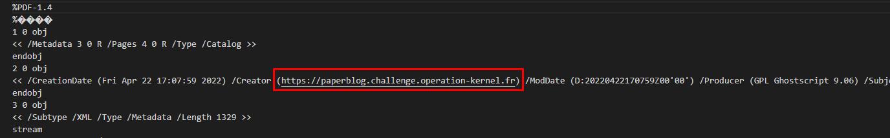
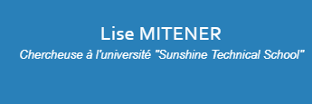

# Research Paper

## Description :

Un scientifique a publié un article sur une technologie nucléaire de pointe qui pourrait révolutionner le domaine de l’énergie

Ces recherches, très novatrices, vont surement être convoitées par des personnes malveillantes et nous devons le retrouver pour le protéger.

L'article est disponible au format pdf. Il n'a laissé ni nom, ni aucune autre information dans son article qui permettent de l'identifier, cependant il existe probablement un moyen à partir du document de récupérer plus de données pour le retrouver.

## Information complémentaire : 
Dans un fichier, il y a ce que l'on voit (son contenu) mais aussi les données que l'on ne voit pas.

## Source :
paper-047e3cdb90edd.pdf

---

## Resolution : 

Indice mis à notre disposition :
- L'information complémentaire qui sonne comme une énigme.

D'après l'indice il faut chercher dans les données qu'on ne voit pas. Du coup, j'ai ouvert le fichier pdf avec visual studio code et j'ai remarqué dans les metadata un lien étrange : 

En allant sur le lien https://paperblog.challenge.operation-kernel.fr/, j'ai obtenu les informations nécessaire à la validation son prénom et son nom.

Voici le flag final : `HACK{Lise.MITENER}`