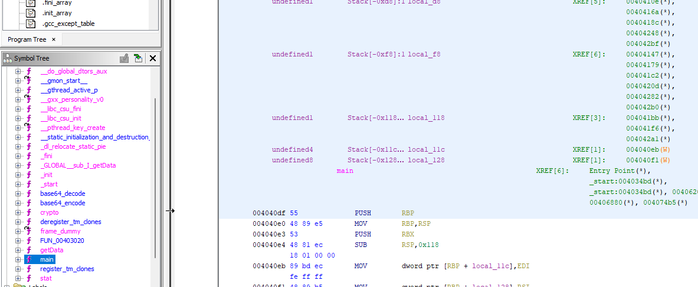
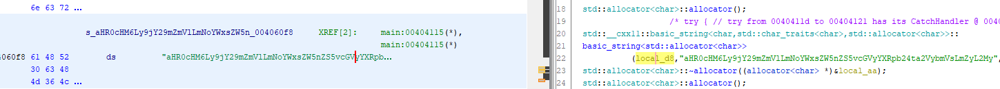
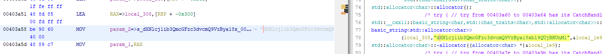
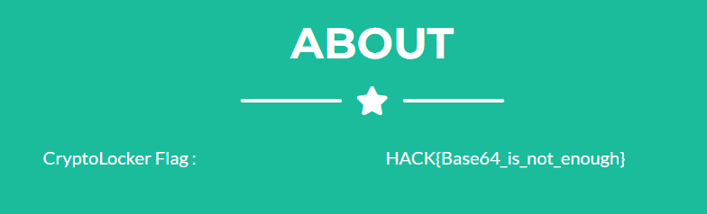

# CryptoLocker

## Description :

Les preneurs d'otages ne sont que des mercenaires payés pour faire le sale travail. Aucun d'entre eux n'a suffisamment d'information pour identifier les commanditaires.

Une fois la situation revenue sous contrôle, Lise MITENER a récupéré son ordinateur personnel. Malheureusement, cette dernière nous indique que ces fichiers sont devenus illisibles.
Visiblement, la totalité de ses documents a été chiffrée. Nos équipes ont pu retrouver l'exécutable à l'origine de cette modification, voyez s'il est possible d'en extraire des informations nous permettant de remonter la trace des commanditaires.

## Information complémentaire : 
Il est fort probable que les preneurs d'otage n’ont pas été payés uniquement pour chiffrer les fichiers de madame MITENER. Les commanditaires sont surement intéressés par ses recherches, ainsi, les documents ont probablement été téléversés sur un serveur distant.

## Source :
cryptolocker

---

## Resolution : 

Indice mis à notre disposition :
- Le chiffrement des données n'est pas uniquement le but principal.
- Les données ont probablement été téléversés sur un serveur distant.

Pour résoudre ce challenge j'ai utilisé l'outil [Ghidra](https://github.com/NationalSecurityAgency/ghidra).
Une fois Ghidra ouvert, j'ai inséré le fichier obtenu puis Ghidra l'a analysé. J'ai été regardé dans la fênetre "Symbol Tree" dans le dossier "Functions".

J'ai remarqué qu'il y'avais plusieurs fonctions qui pourraient être intéressantes comme : Main, GetData, Crypto, Base64Encode et Base64Decode. 

En allant dans la fonction "Main", j'ai remarqué qu'il y'avait un string encodé surement en base64. 

Je l'ai copié "aHR0cHM6Ly9jY29mZmVlLmNoYWxsZW5nZS5vcGVyYXRpb24ta2VybmVsLmZyL2My" et j'ai été sur [Base64 Decode](https://www.base64decode.org/). J'ai obtenu un site web https://ccoffee.challenge.operation-kernel.fr/c2.

Maintenant que j'ai le site faut trouver le moyen de s'authentifier dessus. Je me suis donc intéressé à la fonction "Crypto" pour savoir comment fonctionne le binaire et j'ai remarqué une autre string encodée également en base64.

J'ai copié la string "dXNlcj1ib3QmcGFzc3dvcmQ9VzBya18xbl9QUjBHUnM1", puis je l'ai également mis sur Base64 Decode. J'ai obtenu un login et un password dans ce format là : `user=bot&password=W0rk_1n_PR0GRs5`.

Maintenant que j'ai le login et le mot de passe, j'ai essayé de me connecter au site. Ca fonctionne ! Donc j'ai juste scrollé la page et allant dans la partie "About" j'ai remarqué le flag qui était présent.

Voici le flag final : `HACK{Base64_is_not_enough}`