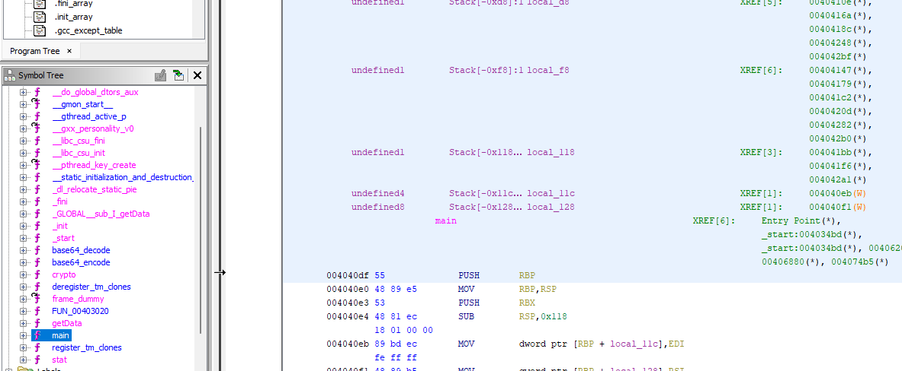
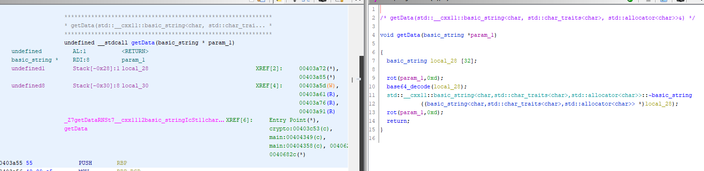
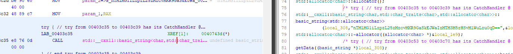

# CryptoLocker

## Description :

Qu'est-ce qui se passerait si c'était plus complexe ?

Il est nécessaire de continuellement monter en compétence afin de pouvoir faire face aux menaces futures. Nos équipes ont donc recréé le scénario d'attaques en relevant le niveau technique.

## Information complémentaire : 
L'objectif reste le même : retrouver l'URL, le nom d'utilisateur et le mot de passe utilisé par le cryptolocker.

## Source :
crypto

---

## Resolution : 

Indice mis à notre disposition :
- Même objectif que le challenge précédent.

Pour résoudre ce challenge j'ai utilisé l'outil [Ghidra](https://github.com/NationalSecurityAgency/ghidra).
Une fois Ghidra ouvert, j'ai inséré le fichier obtenu puis Ghidra l'a analysé. J'ai été regardé dans la fênetre "Symbol Tree" dans le dossier "Functions".

J'ai remarqué qu'il y'avais plusieurs fonctions qui pourraient être intéressantes comme : Main, GetData, Crypto, Base64Encode et Base64Decode. 

En allant dans la fonction "Main", j'ai remarqué qu'il y'avait un string encodé comme précédament j'ai essayé de décode ce string avec [Base64 Decode](https://www.base64decode.org/) mais celà n'a pas fonctionné.

Après quelques recherches, j'ai remarqué la fonction `getData` dont on peut avoir un visuel dans la partie décompile de Ghidra.
Celle-ci a changé comparé au challenge 1, on peut remarquer qu'il un chiffrement par décalage (rot).

Je me dis que le programme n'a pas changé hormis l'ajout de cette fonction "Rot" donc dans la fonction "Main" ce qui est chiffré doit être le lien.
Je m'intéresse à la fonction "Crypto" afin de récupérer un potentiel login / mot de passe ! 

J'ai copié le string "nTMlMG1iLzpzL25zMzcvMKR9GaSkEJWaIzMTM3M5rHSvM1WuLzu0qD==", on peut remarquer que sur l'image 2 la fonction rot utilise un string en paramètre et un nombre derrière `0xd` qui donne 13 en décimal. J'en déduis donc qu'il faut dechiffrer ça en Rot13, j'ai utilisé le site [Rot-13 Decode](https://www.dcode.fr/chiffre-rot-13)

J'obtiens donc un nouveau chiffrement qui est en base64 vu que si on suit la logique du code (voir image 2), il fait un rot du string puis il le met en base64 avant de le remettre en rot.
Chiffrement obtenu `aGZyZT1vYmcmY25mZmpiZXE9TnFxRWJnVmZGZ3Z5eUFiZ1JhYmh0dQ==`, donc je l'ai décode avec [Base64 Decode](https://www.base64decode.org/) ce qui m'a donné un nouveau chiffrement en rot13 `hfre=obg&cnffjbeq=NqqEbgVfFgvyyAbgRabhtu`.

J'ai donc copier le nouveau chiffrement sur le site [Rot-13 Decode](https://www.dcode.fr/chiffre-rot-13) et re-déchiffré celui-ci j'ai obtenu `user=bot&password=AddRotIsStillNotEnough`

Voici le flag final : `HACK{bot_AddRotIsStillNotEnough}`