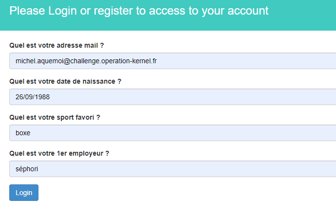

# Pour vivre secure vivons caché

## Description :
Dans le fichier excel récupéré précedemment, nous avons identifié une autre personne.
Nos équipes ont retrouvé un blog lui appartenant.
Il serait probablement intéressant d'examiner ce dernier à la recherche d'informations concernant cette personne.

## Information complémentaire : 
Noter le maximum d'informations sur la personne pour ensuite les utiliser afin de récupérer son compte mail.

## Source :
blog.challenge.operation-kernel.fr

---

## Resolution : 
Indices mis à notre disposition :
- Dans l'information complémentaire on nous demande de récuperer le maximum d'information sur la personne.

### Le blog
Pour débuter on nous donnes un lien d'un blog https://blog.challenge.operation-kernel.fr/, quand je relis l'information complémentaire on parle d'un compte mail. Donc je vais sur la page contact, je remarque cette phrase "Si vous êtes intéresse contactez moi  : [ici](https://fakebook.challenge.operation-kernel.fr/)"

### Le fakebook
En cliquant sur le lien précédamment eu j'ai attérit sur la page fakebook de notre blogeur Aquemic. Sur cette page on peut récuprer des informations utiles pour la suite !
- Prenom : Michel
- Nom : Aquemoi
- Date de naissance : 25 septembre 1988
- Instagram : [Shopeors](https://instafakegram.challenge.operation-kernel.fr/)
- Linkedin : [michel-aquemoi-19082216b](https://linkedfakein.challenge.operation-kernel.fr/)
- Ville : Saint-Etienne

Je décide donc d'aller fouiller son linkedin.

### Le linkedin.
En regardant sa page linkedin j'obtiens plusieurs informations importante pour la suite :
- Email : michel.aquemoi@challenge.operation-kernel.fr
- Travail : Séphori

Et je remarque donc qu'il utilise le "futur gmail", qui me renvoie sur un site permettant de consulter ses mails (https://mail.challenge.operation-kernel.fr/login.php).

### Le InstaFake
Sur son instagram on peut remarquer qu'il aime beaucoup la box.

### Gmail du futur
En arrivant sur le gmail du futur, je remarque qu'on a seulement 3 possibilités : Login / Register / Forgot Password. Et on nous demande dans l'énnoncé de récupérer le mail de la personne, je décide de cliquer sur "Forgot Password ?".

En allant sur cette page, je vois plusieurs question à l'écran permettant de me connecter avec le compte de l'utilisateur. Ca tombe bien grâce aux informations récupérés précédemment je peux répondre facilement aux questions.

Une fois connecté, je remarque un mail avec en titre "Confidentiel" je l'ouvre et je vois le flag !

Voici le flag final : `HACK{SE_Inf0_Ar3_3veRyWH3R3}`