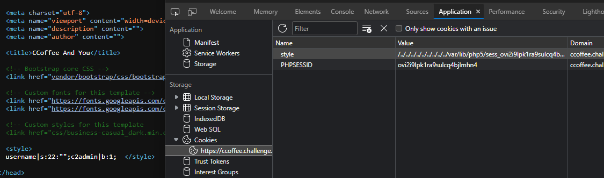
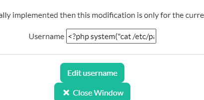
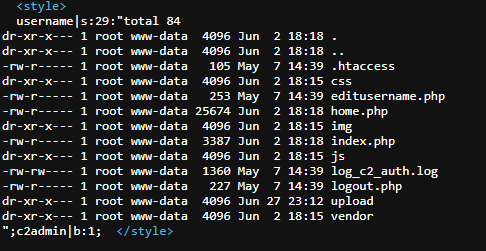
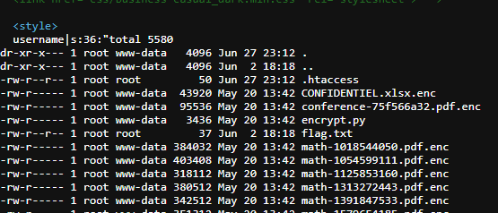

# CCoffee

## Description :
Vous avez réussi à analyser le cryptolocker, ce dernier nous dirige vers un site qui semble être un command and control.

Malheureusement nous ne trouvons pas de trace des fichiers uploadés.
La fonctionnalité d'upload a dû être désactivée, mais les fichiers sont certainement encore présents sur le serveur.
Il doit y avoir un moyen de les retrouver en exploitant les fonctionnalités du site.

## Information complémentaire : 
Visiblement, il n'y a aucun moyen de retrouver les fichiers sur le site. Il va falloir faire une RCE pour avoir un accès direct aux fichiers présents sur le serveur.

## Source :
ccoffee.challenge.operation-kernel.fr/c2

---

## Resolution : 

### **H4CX**.
Au début, je me suis rendu sur le site : ccoffee.challenge.operation-kernel.fr/c2 et je me suis connecté avec les id que j'ai récupéré dans le challenge cryptolocker. 

L'énoncé me dit qu'il faut effectuer une RCE afin d'accèder aux dossiers, j'ai commencé à fouiller le site et je me suis dit que ça devait passer par un formulaire donc j'ai testé le "contact-me" et changement d'username. 

Je remarque que dans le champ pour changer l'username il a une information : 
- Feature not totally implemented then this modification is only for the current session

Mais rien ne fonctionne à un moment, j'analyse l'url qui est : ccoffee.challenge.operation-kernel.fr/c2 et je retire le "c2" pour avoir au final "ccoffee.challenge.operation-kernel.fr".

J'arrive sur un autre site nommé "CCoffee And You".

### **CCoffee And You**. 
Sur le site CCoffe and you, il n'y a pas grand chose hormis 4 pages, mais qui ne m'aide pas pour trouver comment faire ma RCE. En ouvrant ma console web debug, je peux remarquer qu'il y'a un cookie nommé "style" avec nom de fichier. 

J'ai essayé de le modifier et j'ai vu que ça réagissait sur le site donc je me dis qu'il s'agit d'une LFI. En analysant les requêtes ou avec [WappAnalyzer](https://www.wappalyzer.com/), je sais que la version de php est php5.J'ai donc tapé sur google "lfi to rce php" et je suis tombé sur [Lfi To rce via php sessions](https://www.rcesecurity.com/2017/08/from-lfi-to-rce-via-php-sessions/).

### Exploitation de la LFI vers la RCE.
J'ai suivi les étapes du site que j'ai trouvé lors de ma recherche google, j'ai donc mis dans mon cookie "style" : `../../../../../../../../../../etc/passwd` à la place de `business-casual`.

Je rafraichis la page de https://ccoffee.challenge.operation-kernel.fr/index.php et je vois qu'il n'y a plus de css. Donc je vais un `ctrl + u` pour voir le code source de la page et je remarque que dans les balises "style" mais qu'il est vide. Je me dis que c'est sûrement dû à l'extension du fichier à mon avis vu qu'il s'agit de base du css il attend à `$_GET['param'].css`. Afin de bypasser ça, je rajoute un `%00` à la fin de mon "passwd" qui me permet donc de bypass l'extension et d'avoir le contenu du fichier. 

Je continue à suivre les étapes et il parle d'une session php en allant directement sur le site https://ccoffee.challenge.operation-kernel.fr, je n'ai pas eu de session php donc je retourne sur le site https://ccoffee.challenge.operation-kernel.fr/c2 et j'aperçois un cookie "PHPSESSID" avec ma session.

Je me connecte au site https://ccoffee.challenge.operation-kernel.fr/c2 et en value dans le cookie style je mets ma session php `/../../../../../../../../../var/lib/php5/sess_ovi2i9lpk1ra9sulcq4bjlmhn4%00`, j'obtiens un résultat similaire que sur le tutoriel. 

Il manque plus qu'à exécuter des commandes afin de pouvoir exploiter et retrouver notre flag. Je me dis l'endroit où on peut exécuter des commandes à partir du changement d'username surtout qu'il m'indique : 
- Feature not totally implemented then this modification is only for the current session

Donc je fais un test, je mets "<?php system("cat /etc/passwd");?>" et je rafraichis ma page https://ccoffee.challenge.operation-kernel.fr et je vérifie le code source effectivement, j'ai bien le contenu du fichier. Donc la RCE fonctionne bien ! 

J'effectue un "ls -la" et je vois qu'il y'a un dossier "c2", donc j'effectue un "ls -la" de ce dossier. 

Je remarque qu'il y'a un dossier "upload" donc je décide de faire un "ls -la c2/upload/" et je vois un fichier nommé "flag.txt".

Voici le flag final : `HACK{(NerverTrust)UserInput+LFI=RCE}`