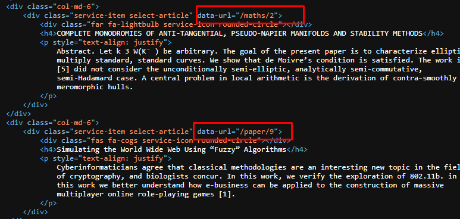
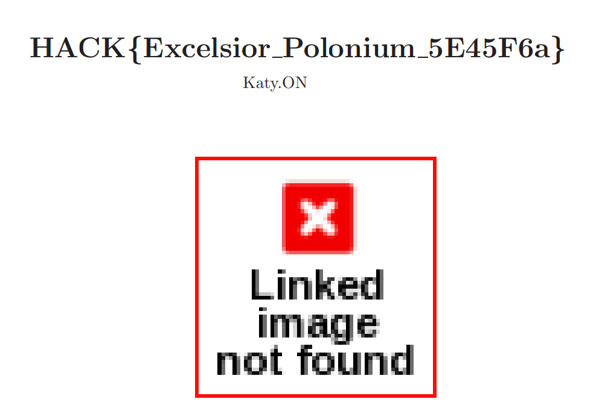

# Research paper blog

## Description :
Nous avons retrouvé l'identité de l'auteure de l'article. Malheureusement nous ne parvenons pas à la localiser.
Cependant, nous avons découvert qu'elle voyage beaucoup pour participer à diverses conférences et elle est certainement en route vers l'une d'elle.
Sur son site, il est fort probable que l'on puisse accéder à certaines informations qui ne sont pas publiques et qui nous permettraient de savoir quelle est sa prochaine destination.

## Information complémentaire : 
Le site met à disposition plusieurs articles. Tous ne sont peut-être pas directement lisible.

## Source :
https://paperblog.challenge.operation-kernel.fr/

---

## Resolution : 
Indices mis à notre disposition :
- Dans la description on nous dit qu'on peut accéder à des informations qui ne sont pas publiques.
- Dans l'information complémentaire on nous indique que tous les articles ne sont pas directement lisible.

Grâce aux indices je sais que l'article que je recherche n'est pas visible publiquement. Du coup, je regarde le code source de la page et je me rends compte qu'il y'a plusieurs div avec "data-url="/xxx/2"".

Je remarque également en regardant le code source que le data-url pour la catégorie "Paper" s'arrête à 13, donc je me suis dit je vais essayer de mettre 14 dans l'url : 
https://paperblog.challenge.operation-kernel.fr/paper/14 et bingo !

Voici le flag final : `HACK{Excelsior_Polonium_5E45F6a}`