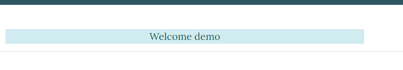
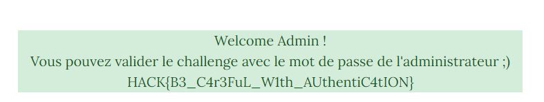

# SQL Project 1

## Description :
L'auteur d'un blog de sécurité informatique affirme que son site est parmi les plus sécurisés de tous et donc impénétrable. Ça ne coûte rien de vérifier une telle affirmation...

## Information complémentaire : 
L'une des attaques les plus répandues sur les formulaires d'authentification en ligne reste l'injection SQL. Elle permet d'accéder à un grand nombre d'informations.

Vous devez essayer de vous connecter sur le compte admin du site en contournant la sécurité.

## Source :
secureblog.challenge.operation-kernel.fr

---

## Resolution : 
Indices mis à notre disposition :
- Le nom du challenge "Sql".
- L'une des attaques les plus répandues sur les formulaires d'authentification en ligne reste l'injection SQL.

En se rendant sur le site, j'ai remarqué que celui-ci possédais une page "Login" avec un formulaire de connexion.
Je sais qu'il faut réaliser une injection SQL via le formulaire de connexion donc j'ai tapé ça :
- Username : admin' or '1'='1'#
- Password : toto

J'obtiens donc : 

J'arrive à obtenir un résultat pas trop mal mais ce n'est pas ça. En fouillant sur internet, j'ai remarqué qu'il manquait un truc dans mon injection sql dans beaucoup d'exemple j'ai remarqué que l'injection utilisé est : admin' or '1'='1 **--**# donc j'ai rajouté les "--" et enlevé le `'` en trop ce qui donne :
- Username : admin' or '1'='1 -- #
- Password : toto

J'obtiens donc : 

Voici le flag final : `HACK{B3_C4r3FuL_W1th_AUthentiC4tION}`